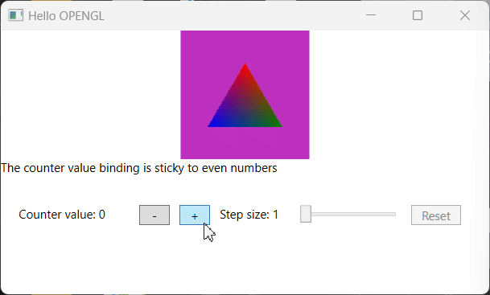

# Create WPF OPENGL apps with F#

As you probably know, GUI and functional programming aren't traditionaly popular together and specially paired with graphics programming. If you're enthuasiast of the mentioned technologies, give this template a go!

## Elevator pitch:

**Why should you use this template?**
- F# enforces you to write code in a composable and easily testable manner. It's immutable by default, it has beautiful syntax and rich ecosystem as it's part of .NET where you can natively operate with your favorite C# libraries.
- You get OpenGL canvas inside WPF which you can style however you want.
- [OpenTK](https://opentk.net/) and Elmish.WPF are  dependencies of this project. You can use it from the get go.
- Includes simple "Hello triangle" example with Elmish.WPF.
- Not dependant on IDE. Just use DOTNET CLI.

## Building:

View folder is the root of the project.

```
cd view
dotnet run
```

After successful build you should see this:


## Potential improvements:
- Domain Specific Language (DSL) or CLI tool which would generate bindings from XAML to F#
- Depends on your use case but if you separe OpenGL from WPF in the build phase (Debug build and ship), you can ship it anywhere! (Win, Linux, Mac, Android, etc...) 